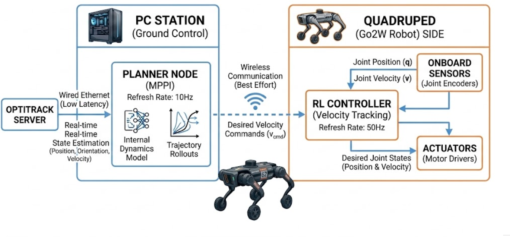
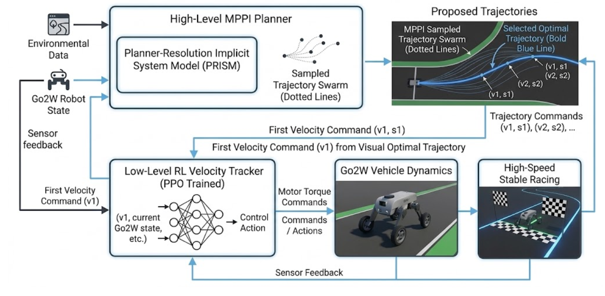

# Go2W Racing: How Fast is Your Dog

**Team Member:** Yuxiang Liu  
**Affiliation:** Model Predictive Control (MPC) Lab, UC Berkeley  

  <iframe width="700" height="394" src="https://www.youtube.com/embed/MmMLaRlwG2E" title="Go2W Full Stack Racing Demonstration" frameborder="0" allow="accelerometer; autoplay; clipboard-write; encrypted-media; gyroscope; picture-in-picture; web-share" allowfullscreen></iframe>

---

## 1. Introduction

### (a) Project End Goal
Empower the Unitree Go2W robot to conquer the Berkeley Autonomous Racing Car (BARC) L-shaped track, achieving ultra-stable and high-speed autonomous racing.

### (b) Motivation and Engineering Challenges
Controlling a wheeled quadruped at high speeds requires a delicate balance of navigation and complex joint articulation. To make the system work, several core technical problems must be solved:
* **High Dimensionality:** The state space is exceptionally large, comprising 12 articulate joints and 4 motorized wheels.
* **Planning Horizon:** High-speed racing requires a long prediction horizon (greater than 1.5 seconds) to anticipate sharp turns.
* **Hardware Realities:** Physical deployments introduce unmodeled observation latencies and thermal limitations that cause standard simulation algorithms to fail on physical hardware.

### (c) Real-World Applications
The control architecture developed for this project has direct applications in real-world environments requiring rapid, stable, and agile navigation. This includes rapid autonomous delivery, industrial site inspections, and time-critical search and rescue operations where wheeled quadrupeds offer superior mobility over traditional wheeled vehicles or pure walkers.

---

## 2. Design

### (a) Design Criteria
The system must generate smooth, collision-free trajectories and execute them at high velocities without triggering hardware faults. It must maintain stability under physical constraints, such as motor thermal limits, and successfully bridge the gap between simulation physics and real-world hardware behavior.

### (b) Chosen Architecture: MPC-RL Hybrid
We designed a hybrid control pipeline that utilizes Model Predictive Control (MPC) for high-level planning and Reinforcement Learning (RL) for low-level execution. 

### (c) Design Choices and Trade-Offs
Neither a pure MPC nor a pure RL approach was viable for the full stack:
* **Why not whole-stack MPC?** The computational burden of optimizing over a long prediction horizon combined with a massive state space makes real-time pure MPC intractable for this platform.
* **Why not whole-stack end-to-end RL?** Pure RL suffers from the "Long Horizon Curse," resulting in sparse rewards and highly unstable training. Furthermore, an end-to-end policy would lack generalization (becoming track-specific) and suffer from severe Sim2Real inaccuracies at high-speed regions.

By splitting the stack, we traded the theoretical simplicity of an end-to-end model for the practical robustness of a divided architecture. We assigned path planning to an MPPI (Model Predictive Path Integral) planner and velocity tracking to a robust RL policy. 

### (d) Impact on Real-World Engineering Criteria
This division of labor highly benefits system robustness and efficiency. The high-level MPPI iteratively generates a trajectory swarm and selects the optimal path for the specific track, ensuring generalization and adaptability. Simultaneously, the low-level RL tracker handles the complex nonlinear dynamics and hardware disturbances, operating efficiently enough to maintain a high control frequency.

---

## 3. Implementation

### (a) Hardware Setup
The hardware ecosystem is divided between a Ground Control PC Station and the Go2W Robot. 

### (b) System Components
* **OptiTrack Server:** Provides real-time state estimation (position, orientation, and velocity).
* **Ground PC:** Runs the high-level Planner Node.
* **Go2W Robot:** Houses the onboard sensors (joint encoders) and actuators (motor drivers), and executes the RL controller. 

### (c) Software Stack

* **High-Level MPPI Planner:** This node runs on the PC at a 10 Hz refresh rate. It utilizes the newly developed Planner-Resolution Implicit System Model (PRISM) as its internal dynamics engine. PRISM allows for rapid sampling-based optimization with a solving time of 0.08s per solving step. 
* **Low-Level RL Velocity Tracker:** This is a PPO-trained neural network running directly on the quadruped. We trained our own pipeline (based on `fan-ziqi/robot_lab`), because commercial Unitree RL trackers are closed-source and existing open-source projects lack deployment pipelines and model weights. 

### (d) Step-by-Step System Operation
1.  The OptiTrack server feeds low-latency, real-time environmental and robot state data to the PC Planner via wired Ethernet.
2.  The MPPI planner uses PRISM to generate trajectory rollouts, selecting an optimal path and deriving a desired velocity command.
3.  This desired velocity command is transmitted to the robot via a "best effort" wireless connection.
4.  The onboard RL controller takes the velocity command and current joint states, running at exactly 50 Hz, to output precise desired joint positions and velocities to the actuators.

---

## 4. Results

### (a) Project Performance and Task Execution
The Go2W successfully completed high-speed autonomous laps around the BARC track. Achieving this required solving two major Sim2Real deployment hurdles:
* **Overcoming Sensor Latency:** Early tests showed severe hardware jitter due to an unmodeled 10–15ms latency in the onboard joint sensors. We implemented Domain Randomization by adding delay buffers in the simulator, treating latency as a randomized training parameter.
* **Motor Overload Protection:** The initial RL agent exhibited reward hacking by utilizing aggressive gaits that sustained 20Nm of torque, triggering an "Error 16" hardware overload in just 20 seconds. We applied Reward Shaping to penalize high energy use and torque variance, successfully enforcing a balanced power distribution below a 15Nm benchmark. This optimized the policy to be significantly more torque-efficient and motor-friendly, dropping energy consumption from 124,622 Joules down to 85,833 Joules—making the system 1.45x more energy efficient. 

### (b) Visuals
*(Insert Joint Torque Charts)*
``

---

## 5. Conclusion

### (a) Discussion of Results
The MPC-RL Hybrid pipeline successfully met the design criteria, effectively blending the predictive foresight of MPPI with the dynamic agility of an RL tracker. Managing the torque limits via reward shaping proved critical in transitioning the robot from a simulated environment to sustainable physical reality.

### (b) Difficulties Encountered
Aside from thermal overloads, the most persistent difficulty was the instability of the wireless communication between the PC station and the robot. The system frequently dropped approximately 30 velocity commands every 10 seconds. This caused the real-world trajectories to exhibit noticeable jitter when compared to the perfectly smooth trajectories generated in simulation.

### (c) System Flaws and Future Improvements
The current reliance on off-board computing and external state estimation (OptiTrack) limits the system's true autonomy. Given additional time, future work will focus on two main areas:
1.  **Algorithmic Improvements:** Developing a latency-robust trajectory planner to better handle the inevitable packet drops from wireless communication.
2.  **Hardware Upgrades:** Upgrading the onboard compute capabilities and implementing LiDAR-based SLAM. This will eliminate the reliance on the external OptiTrack system entirely, allowing the Go2W to race and navigate in fully uninstrumented environments.
